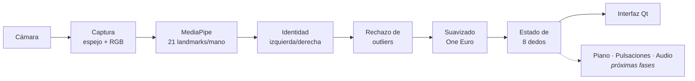
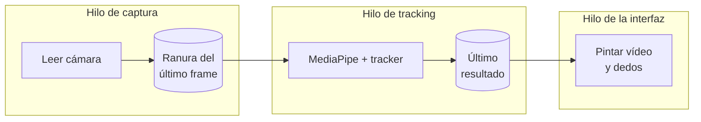

# 🎹 HandPiano

**Instrumento virtual controlado con las manos mediante visión por computador.**

HandPiano es una aplicación de escritorio que usa la cámara del ordenador para seguir tus manos y dedos en tiempo real, con el objetivo de tocar un piano virtual en el aire. Todo se procesa **localmente**: no hay servidor, ni navegador, ni envío de imágenes a Internet.


-lightgrey?logo=apple)

-41CD52?logo=qt&logoColor=white)


---

## Índice

1. [Estado del proyecto](#estado-del-proyecto)
2. [Características](#características)
3. [Instalación](#instalación)
4. [Uso](#uso)
5. [Cómo funciona](#cómo-funciona)
6. [Estructura del proyecto](#estructura-del-proyecto)
7. [Métricas y Tracking Lab](#métricas-y-tracking-lab)
8. [Tests](#tests)
9. [Privacidad](#privacidad)
10. [Limitaciones](#limitaciones)
11. [Solución de problemas](#solución-de-problemas)
12. [Hoja de ruta](#hoja-de-ruta)

---

## Estado del proyecto

| Fase | Contenido | Estado |
| --- | --- | --- |
| A–B | Análisis y aplicación de escritorio mínima | ✅ Hecho |
| C | Cámara real: detección, configuración, valores reales | ✅ Hecho |
| D–E | MediaPipe y visualización de landmarks | ✅ Hecho |
| F | Seguimiento temporal de 8 dedos con suavizado | ✅ Hecho |
| K (parcial) | Métricas de rendimiento y Tracking Lab | ✅ Hecho |
| G | Piano virtual con geometría real | ⏳ Pendiente |
| H | Detección de pulsaciones (máquina de estados) | ⏳ Pendiente |
| I | Motor de audio local | ⏳ Pendiente |
| J | Entrenamiento adaptativo de 20 minutos | ⏳ Pendiente |
| L | Optimización | ⏳ Pendiente |

Hoy la aplicación **ve y sigue las manos y los dedos**, pero todavía **no suena**: el piano, las pulsaciones y el audio son las siguientes fases.

## Características

- 📷 **Cámara real** con selección de dispositivo, resolución y FPS. Muestra lo que la cámara **entrega de verdad**, no lo que se le pidió.
- ✋ **Detección de hasta 2 manos** con 21 puntos (landmarks) por mano, usando MediaPipe.
- 🖐️ **Seguimiento de 8 dedos**: índice, medio, anular y meñique de cada mano, con posición, velocidad y nivel de temblor (jitter).
- 🧭 **Identidad estable de mano izquierda/derecha** entre frames, aunque el detector dude.
- 🪶 **Suavizado One Euro Filter**: estable cuando el dedo está quieto y rápido cuando se mueve.
- 🚫 **Rechazo de saltos imposibles** (fallos puntuales del detector).
- ⚡ **Sin congelar la interfaz**: cámara y detección en hilos separados, procesando siempre el frame más reciente.
- 📊 **Tracking Lab**: panel de depuración con FPS, latencias p50/p95, CPU, estado de cada dedo y más.
- 🔒 **100 % local**: ningún frame se guarda ni se envía.

## Instalación

### Requisitos

- macOS en Apple Silicon (plataforma probada).
- Python 3.11, 3.12 o 3.13.
- Una cámara (la integrada sirve).

### Pasos

```bash
git clone https://github.com/kcitas/hand-piann0.git
cd hand-piann0

python3.13 -m venv .venv
source .venv/bin/activate
pip install -e ".[dev]"

# Descarga el modelo de detección de manos (~7.8 MB).
# Es la ÚNICA vez que hace falta Internet.
python scripts/download_model.py
```

<details>
<summary>Alternativa con <code>uv</code></summary>

```bash
uv venv --python 3.13 .venv
source .venv/bin/activate
uv pip install -e ".[dev]"
python scripts/download_model.py
```
</details>

> **Sobre las dependencias**
> - `mediapipe` ya instala su propio OpenCV (`opencv-contrib-python`). **No** instales `opencv-python` aparte: los dos aportan el módulo `cv2` y entran en conflicto.
> - Se usa `PySide6-Essentials` y no el paquete `PySide6` completo, que añade unos 500 MB que la app no necesita.

## Uso

```bash
source .venv/bin/activate
python -m handpiano          # o simplemente: handpiano
```

| Opción | Descripción |
| --- | --- |
| `--lab` | Abre con el Tracking Lab visible |
| `--camera N` | Índice de la cámara (por defecto `0`) |
| `--width W --height H` | Resolución solicitada (por defecto `1280×720`) |
| `--fps F` | FPS solicitados (por defecto `30`); la cámara puede entregar otro valor |
| `--no-mirror` | Desactiva la vista espejo |
| `-v` | Registro detallado |

Desde la ventana:

- **Buscar cámaras**: detecta las cámaras disponibles.
- **Resolución / FPS → Aplicar**: reinicia la cámara con los nuevos ajustes.
- **Tracking Lab**: muestra el esqueleto de la mano, la etiqueta de cada dedo y todas las métricas.

En pantalla, cada punta de dedo aparece como un círculo: **cian** para la mano izquierda y **violeta** para la derecha. Un círculo hueco significa que la posición es la última conocida, porque el dedo se perdió hace menos de 120 ms.

> **Permiso de cámara en macOS:** la primera vez, macOS pide permiso para la aplicación desde la que ejecutas Python (Terminal, iTerm, VS Code…). Si lo deniegas, ve a *Ajustes del Sistema → Privacidad y seguridad → Cámara*, actívalo y reinicia esa aplicación.

## Cómo funciona

### Flujo general



### Hilos: nunca procesar frames viejos



La **ranura del último frame** guarda un solo frame. Si la detección es más lenta que la cámara, el frame anterior se **sobrescribe** (y se cuenta como descartado) en lugar de hacer cola. Para un instrumento es mejor perder un frame que acumular medio segundo de retraso.

La interfaz pinta **el mismo frame que se analizó**, así que los puntos siempre coinciden con la imagen.

### Paso a paso

1. **Captura.** OpenCV lee la cámara (AVFoundation en macOS). El frame se refleja como un espejo y se convierte a RGB.
2. **Detección.** MediaPipe Hand Landmarker, en modo VIDEO, estima 21 puntos por mano: muñeca y 4 articulaciones por dedo. Las coordenadas `x, y` van de 0 a 1 respecto a la imagen; `z` es una profundidad aproximada relativa a la muñeca.
3. **Identidad de la mano.** MediaPipe decide frame a frame si una mano es izquierda o derecha y a veces se equivoca. Para que los dedos no cambien de identidad de golpe, se aplican estas reglas:
   - dos manos con etiquetas distintas → se usan las etiquetas;
   - dos manos con la misma etiqueta → se separan por posición horizontal;
   - una sola mano cerca de donde estaba → conserva su identidad salvo que el detector diga lo contrario durante **6 frames seguidos**.
4. **Rechazo de outliers.** Si la mano "salta" a más de 8 anchos de imagen por segundo, es casi seguro un fallo del detector: se ignora ese frame y se mantiene la última posición buena. Si el salto se repite más de 2 frames, se acepta, porque la mano realmente se movió.
5. **Suavizado One Euro** ([Casiez et al., 2012](https://gery.casiez.net/1euro/)). Es un filtro paso bajo cuyo corte sube con la velocidad: elimina el temblor cuando el dedo está quieto y casi no añade retraso cuando se mueve rápido, justo lo que necesita un instrumento. Los tests demuestran que, con el mismo temblor en reposo, sigue un movimiento brusco antes que un promedio exponencial fijo.
6. **Estado de los dedos.** Para cada uno de los 8 dedos se calcula la posición suavizada de la punta, la velocidad y el jitter, además de su estado:

   | Estado | Significado |
   | --- | --- |
   | `TRACKED` | Datos frescos en este frame |
   | `HELD` | Sin datos válidos hace ≤ 120 ms; se mantiene la última posición |
   | `LOST` | Sin datos durante más tiempo |

   Los pulgares se detectan y dibujan, pero no son dedos de juego.

Todos los parámetros (filtro, umbrales, tiempos) están centralizados en [`handpiano/app/config.py`](handpiano/app/config.py) y en las clases `*Config`, para poder ajustarlos y, más adelante, adaptarlos a cada usuario con el entrenamiento.

> El sistema **estima** la posición de los dedos a partir de landmarks de visión por computador; no la mide físicamente. La calidad depende de la luz, el fondo, el ángulo y de si unos dedos tapan a otros.

## Estructura del proyecto

```
hand-piann0/
├── handpiano/
│   ├── app/
│   │   ├── main.py             Punto de entrada y opciones de línea de comandos
│   │   ├── application.py      Controlador: conecta el pipeline con la ventana
│   │   ├── pipeline.py         Hilos de captura y tracking, resultados inmutables
│   │   └── config.py           Configuración central
│   ├── camera/
│   │   ├── camera_config.py    Ajustes pedidos vs. modo realmente entregado
│   │   ├── camera_manager.py   Apertura, búsqueda de cámaras y errores claros
│   │   ├── capture_thread.py   Hilo lector de la cámara
│   │   └── frame.py            Frame y ranura del último frame
│   ├── tracking/
│   │   ├── hand_tracker.py     MediaPipe Hand Landmarker
│   │   ├── landmarks.py        Los 21 puntos, dedos e identificadores de los 8 dedos
│   │   ├── hand_identity.py    Identidad izquierda/derecha estable
│   │   ├── smoothing.py        One Euro Filter
│   │   └── finger_tracker.py   Estado por mano y por dedo
│   ├── instrument/
│   │   └── note.py             Notas musicales, MIDI y frecuencias (base del piano)
│   ├── metrics/
│   │   ├── latency.py          Estadísticas p50 / p95
│   │   ├── performance.py      FPS medidos y CPU
│   │   └── tracking_metrics.py Tasa de pérdida de seguimiento
│   └── ui/
│       ├── main_window.py      Ventana principal y barra de cámara
│       ├── camera_view.py      Vídeo con manos y dedos superpuestos
│       ├── debug_view.py       Tracking Lab
│       ├── format.py           Formato de cifras ("N/A" si no hay dato)
│       └── assets/icon.svg     Icono de la aplicación
├── tests/                      Tests con pytest
├── scripts/download_model.py   Descarga única del modelo
├── models/                     Modelo descargado (no se sube al repositorio)
└── pyproject.toml              Dependencias y configuración
```

## Métricas y Tracking Lab

Todas las cifras se **miden** con relojes de alta precisión. Si un dato no se puede medir, se muestra **N/A**; nunca se inventa.

| Métrica | Qué mide |
| --- | --- |
| FPS medido (cámara) | Frames que entrega la cámara por segundo |
| FPS tracking | Frames que analiza MediaPipe por segundo |
| Inferencia | Tiempo de MediaPipe por frame (p50 / p95) |
| Procesado | Identidad + outliers + suavizado + estado de dedos |
| Espera en cola | Desde que llega el frame hasta que empieza a analizarse |
| Captura → resultado | Desde que llega el frame hasta tener el estado de los dedos |
| Captura → pantalla | Desde que llega el frame hasta que termina de dibujarse |
| Pintado UI | Tiempo de dibujo de la interfaz |
| Frames descartados | Frames sobrescritos antes de analizarse |
| CPU proceso | Uso de CPU en % de **un** núcleo (puede superar 100 %) |
| Score de mano | Confianza de MediaPipe sobre si es mano izquierda o derecha |
| Sin mano | % de frames recientes en los que esa mano no se detectó |
| Jitter por dedo | Temblor de la punta del dedo, en píxeles |

> **Importante:** estas latencias no incluyen el tiempo del sensor de la cámara, el buffer del driver ni la pantalla. Eso ocurre fuera de la app y no se puede medir sin hardware externo, así que la latencia real de extremo a extremo es **mayor** que "Captura → pantalla".

### Resultados medidos

En un MacBook con Apple Silicon, cámara integrada a 1280×720, dos manos visibles y una sesión de 20 s:

| Medida | Valor |
| --- | --- |
| FPS de cámara | ~24 (limitado por la cámara con luz de interior) |
| Inferencia de MediaPipe | p50 12.6 ms · p95 18.3 ms |
| Captura → resultado | p50 13.2 ms · p95 19.5 ms |
| Frames descartados | 1 de 440 |
| 8 dedos seguidos con 2 manos visibles | 100 % de los frames durante 5 s seguidos |

Modos probados en esa cámara: pedir 640×480 entrega **1920×1080**, y pedir 60 fps no da más de unos 24. El FPS que informa el driver (15 o 30) **no coincide** con el medido. Por eso la app siempre muestra el valor real.

Son resultados de una máquina y una sesión concretas, no una garantía.

## Tests

```bash
python -m pytest
```

Hay 76 tests que no necesitan webcam: la cámara y el detector se sustituyen por dobles de prueba con datos controlados. Cubren:

- notas, MIDI y frecuencias;
- cámara: permiso denegado, cámara sin imagen, modo entregado distinto del pedido, búsqueda de dispositivos;
- ranura del último frame y descarte de frames;
- identidad de manos, rechazo de outliers y estados `TRACKED` / `HELD` / `LOST`;
- One Euro Filter, incluida la comparación cuantitativa con un promedio exponencial;
- pipeline completo con cámara y detector simulados;
- interfaz dibujada sin pantalla (Qt offscreen);
- MediaPipe real cargando el modelo local (se omite si el modelo no está descargado).

## Privacidad

- Todo se procesa **en tu ordenador**. El modelo de MediaPipe se ejecuta localmente en la CPU.
- La app **no** sube vídeo, **no** envía imágenes ni landmarks a ningún servicio y **no** guarda frames en disco.
- **No** hay reconocimiento facial ni identificación de personas: solo se detectan manos.
- La única conexión a Internet es la descarga única del modelo con `scripts/download_model.py`.

## Limitaciones

- **FPS de la cámara.** La cámara integrada probada entrega unos 24 fps con luz de interior, y eso marca el techo del seguimiento. Con más luz puede mejorar.
- **Exposición y enfoque.** OpenCV no permite controlarlos en macOS (AVFoundation).
- **Izquierda/derecha.** Las etiquetas asumen vista espejo (opción por defecto). Con `--no-mirror` quedarían invertidas. Aún falta confirmar visualmente que la mano marcada como izquierda es siempre la izquierda real.
- **Oclusión.** Con dedos superpuestos, una mano tapando a la otra o la mano de perfil, las posiciones estimadas pueden ser incorrectas.
- **Profundidad.** `z` es relativa a la muñeca y aproximada; no es una distancia real a la cámara.
- **CPU.** El proceso usa aproximadamente un núcleo completo.
- **Windows.** El código usa librerías multiplataforma, pero no se ha probado en Windows.
- **Aún no suena.** Piano, pulsaciones y audio están pendientes.

## Solución de problemas

| Problema | Solución |
| --- | --- |
| "No se pudo abrir la cámara" | Concede el permiso en *Ajustes del Sistema → Privacidad y seguridad → Cámara* a tu terminal o editor y reinícialo. Cierra otras apps que usen la cámara. |
| "Falta el modelo de detección de manos" | Ejecuta `python scripts/download_model.py` |
| Aviso "cámara lenta" | Mejora la iluminación o baja la resolución |
| `ImportError` relacionado con `cv2` | Asegúrate de no tener `opencv-python` instalado junto a `opencv-contrib-python` |
| No detecta las manos | Mejora la luz, usa un fondo despejado y muestra la palma completa a la cámara |

## Hoja de ruta

- **Piano virtual.** Teclado de 2 octavas con geometría real de teclas blancas y negras. La punta de cada dedo se asigna a la tecla que tiene debajo, con prioridad para las negras si se solapan; ningún dedo tiene una nota fija.
- **Pulsaciones.** Máquina de estados por dedo (HOVER → DOWN → ACTIVE → RELEASE) con histéresis, umbral de confianza y debounce contra falsos disparos.
- **Audio local.** Síntesis polifónica sin clicks ni saturación, con intensidad según la velocidad del ataque y latencia medida.
- **Entrenamiento de 20 minutos.** Sesión guiada que mide al usuario (posición natural, alcance, velocidad, ritmo) y genera un perfil local con los parámetros ajustados a partir de esas mediciones.
- **Optimización.** Ajuste fino de latencia y CPU.
