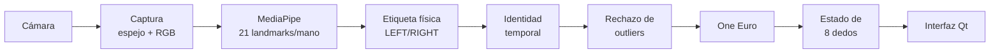
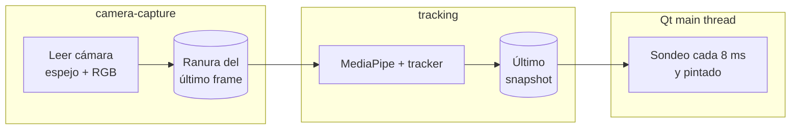

# 🎹 HandPiano

**Instrumento virtual controlado con las manos mediante visión por computador.**

HandPiano es una aplicación de escritorio que usa la cámara del ordenador para seguir las manos y los dedos, con el objetivo de tocar un piano virtual en el aire. Todo se procesa **localmente**: ningún frame, landmark ni dato sale del ordenador.


-lightgrey?logo=apple)

-41CD52?logo=qt&logoColor=white)


---

## Índice

1. [Estado del proyecto](#estado-del-proyecto)
2. [Instalación](#instalación)
3. [Uso](#uso)
4. [Cómo funciona](#cómo-funciona)
5. [Validación LEFT/RIGHT](#validación-leftright)
6. [Métricas](#métricas)
7. [Validación de latencia end-to-end](#validación-de-latencia-end-to-end)
8. [Perfilado de CPU](#perfilado-de-cpu)
9. [Jitter](#jitter)
10. [Suavizado One Euro: qué está demostrado](#suavizado-one-euro-qué-está-demostrado)
11. [Cámara: modos reales](#cámara-modos-reales)
12. [Tests](#tests)
13. [Estructura del proyecto](#estructura-del-proyecto)
14. [Privacidad](#privacidad)
15. [Limitaciones y problemas pendientes](#limitaciones-y-problemas-pendientes)

---

## Estado del proyecto

### Lo que ya funciona

- Aplicación nativa de escritorio (PySide6 / Qt).
- Cámara real con OpenCV, mostrando lo que la cámara **entrega**, no lo que se le pide.
- Detección con MediaPipe Hand Landmarker: hasta **2 manos** y **21 landmarks** por mano.
- Seguimiento temporal de los **8 dedos principales** (índice, medio, anular y meñique de cada mano).
- Identidad **LEFT/RIGHT**, validada con la cámara real (ver [Validación LEFT/RIGHT](#validación-leftright)).
- Suavizado **One Euro Filter**.
- Rechazo de outliers (saltos imposibles del detector).
- Buffer de **último frame**: se descarta un frame viejo antes que acumular retraso.
- **Tracking Lab** (`--lab`) y validación guiada LEFT/RIGHT (`--check-hands`).
- Métricas internas de latencia, CPU, pérdida de tracking y jitter.
- 115 tests automáticos.

### Lo que todavía NO existe

- Piano virtual y geometría de teclas.
- Detección de pulsaciones.
- Audio.
- Entrenamiento adaptativo.
- Medición física de latencia end-to-end (el protocolo está documentado, pero no se ha ejecutado).
- Soporte Windows probado.

## Instalación

Requisitos: macOS en Apple Silicon (plataforma probada), Python 3.11–3.13 y una cámara.

```bash
git clone https://github.com/kcitas/hand-piann0.git
cd hand-piann0

python3.13 -m venv .venv
source .venv/bin/activate
pip install -e ".[dev]"

# Descarga el modelo de detección (~7.8 MB, se verifica el SHA-256).
# Es la ÚNICA vez que hace falta conexión a Internet.
python scripts/download_model.py
```

> - `mediapipe` ya instala su propio OpenCV (`opencv-contrib-python`). **No** instales `opencv-python` aparte: los dos aportan `cv2` y entran en conflicto.
> - Se usa `PySide6-Essentials`, no el paquete `PySide6` completo (~500 MB adicionales que la app no usa).

## Uso

```bash
source .venv/bin/activate
python -m handpiano --lab           # comando principal de diagnóstico
python -m handpiano --check-hands   # validación guiada LEFT/RIGHT con instrucciones en pantalla
python -m handpiano                 # vista normal
```

| Opción | Descripción |
| --- | --- |
| `--lab` | Abre con el Tracking Lab visible |
| `--check-hands` | Validación guiada LEFT/RIGHT (abre también el Lab) |
| `--camera N` | Índice de la cámara (por defecto `0`) |
| `--width W --height H` | Resolución solicitada (por defecto `1280×720`) |
| `--fps F` | FPS solicitados (por defecto `30`) |
| `--no-mirror` | Vista sin espejo |
| `-v` | Registro detallado |

Cada punta de dedo se dibuja en **cian** si es de la mano LEFT y en **violeta** si es de la RIGHT. Un círculo hueco indica que se está mostrando la última posición conocida.

> **Permiso de cámara en macOS:** la primera vez, macOS pide permiso para la aplicación desde la que ejecutas Python (Terminal, iTerm, VS Code…). Si lo deniegas: *Ajustes del Sistema → Privacidad y seguridad → Cámara*, actívalo y reinicia esa aplicación.

### Scripts de medición

| Script | Qué hace |
| --- | --- |
| `scripts/download_model.py [--output PATH]` | Descarga el modelo y verifica su SHA-256 |
| `scripts/camera_matrix.py` | Mide qué resolución y FPS entrega realmente la cámara en cada modo |
| `scripts/profile_cpu.py` | Ejecuta la app real y reporta CPU por componente y latencias internas |
| `scripts/evaluate_smoothing.py` | Evaluación reproducible del One Euro Filter frente a una EMA |

Ninguno guarda frames.

## Cómo funciona



### Hilos



- **`camera-capture`** lee la cámara, refleja el frame y lo convierte a RGB. Después lo deja en una ranura que guarda **un solo frame**. Si llega uno nuevo antes de que se procese el anterior, el anterior se sobrescribe y se cuenta como descartado.
- **`tracking`** carga MediaPipe, abre la cámara y arranca el hilo de captura. Luego procesa siempre el frame más reciente y publica un *snapshot* inmutable: los arrays se publican en solo lectura. Es el único hilo que libera la cámara, y lo hace después de que termine la captura.
- **El hilo principal de Qt** solo lee el último snapshot. Nunca ejecuta MediaPipe ni modifica el estado del tracker.
- `stop()` cierra ambos hilos e informa si alguno no terminó a tiempo. Hay tests que verifican que reiniciar la cámara no deja hilos huérfanos y que detenerla durante la apertura la libera.

### Pasos del tracking

1. **Detección.** MediaPipe (modo VIDEO) estima 21 puntos por mano. `x, y` están normalizados a la imagen (0–1); `z` es una profundidad aproximada relativa a la muñeca.
2. **Etiqueta física.** MediaPipe etiqueta la mano según cómo *se ve* en la imagen, y una mano derecha reflejada parece una izquierda. Por eso, con la vista espejo (opción por defecto), la etiqueta se invierte para obtener la mano física del usuario. Ver [Validación LEFT/RIGHT](#validación-leftright).
3. **Identidad temporal.** Se aplican tres reglas:
   - dos manos con etiquetas distintas → se usan las etiquetas;
   - dos manos con la misma etiqueta → se separan por posición (con espejo, la izquierda del usuario aparece a la izquierda de la imagen);
   - una sola mano → conserva su identidad salvo que el detector diga lo contrario durante 6 frames seguidos.
4. **Outliers.** Si la mediana de los landmarks se mueve a más de 8 anchos de imagen por segundo, se ignora ese frame. Si el salto persiste más de 2 frames, se acepta.
5. **One Euro Filter** sobre los 21 puntos.
6. **Estado de los dedos.** Cada dedo tiene un estado `TRACKED` (datos frescos), `HELD` (sin datos durante ≤ 120 ms, se conserva la última posición) o `LOST`. Además se calculan la posición, la velocidad y el jitter.

Todos los parámetros están centralizados en [`handpiano/app/config.py`](handpiano/app/config.py) y en las clases `*Config`.

> El sistema **estima** la posición de los dedos a partir de landmarks de visión por computador. No es una medición física.

## Validación LEFT/RIGHT

La visión por computador no sabe cuál es tu mano física izquierda: solo ve una forma. Por eso la validación es **manual, asistida por la app**.

### Cómo comprobarlo

**Opción guiada (recomendada):**

```bash
python -m handpiano --check-hands
```

Un banner en la ventana indica cada paso con cuenta atrás:

1. **Prepárate** (5 s).
2. **Solo la mano IZQUIERDA** (10 s): debe aparecer `LEFT` (cian).
3. **Solo la DERECHA** (10 s): debe aparecer `RIGHT` (violeta).
4. **Ambas, separadas y sin cruzar** (10 s): con vista espejo, LEFT debe quedar en la mitad izquierda de la imagen.

Se ignora el primer segundo y medio de cada paso, para dar tiempo a cambiar de postura. Al final se muestra, para cada paso, el porcentaje de frames correctos y qué combinación de manos se detectó (por ejemplo, `visto: LEFT 204`). Un paso se aprueba con al menos 30 frames evaluados y un 90 % de acierto; con menos frames, el resultado es "datos insuficientes".

**Opción manual:** con `python -m handpiano --lab`, cada mano muestra una etiqueta grande `LEFT`/`RIGHT` con sus cuatro dedos. Si la identidad temporal mantiene una etiqueta distinta de la que dio el detector en ese frame, aparece en amarillo *"detector: … · se mantiene por continuidad"*. Para comprobarlo:

1. levanta solo la mano izquierda y mira qué etiqueta aparece;
2. repite con la derecha;
3. levanta ambas;
4. muévelas y comprueba que la identidad no cambia sin motivo.

El Lab muestra además el **orden espacial coherente** (en los frames con dos manos, el porcentaje en que cada una está en el lado esperado) y cuántos frames se corrigieron por continuidad.

### Resultado

**Se encontró una inversión real y se corrigió.** Con la cámara real y la vista espejo, al levantar ambas manos con las palmas hacia la cámara y sin cruzarlas, MediaPipe etiquetó como `"Right"` (0.95) la mano izquierda del usuario y como `"Left"` la derecha. Se comprobó visualmente en capturas anotadas. Además, en los frames con dos manos, LEFT quedaba a la derecha de RIGHT en 7 de 8 casos. Este fallo hacía que la regla de posición y las etiquetas del detector se contradijeran.

Después de la corrección, el 8 de octubre de 2026, con `--check-hands` y el usuario siguiendo las instrucciones:

| Paso | Acierto | Frames | Detectado |
| --- | --- | --- | --- |
| Solo izquierda → LEFT | 100 % | 204 | LEFT 204 |
| Solo derecha → RIGHT | 100 % | 195 | RIGHT 195 (10 frames sin mano) |
| Ambas, orden espacial | 100 % | 204 | LEFT+RIGHT 204 |

Un intento anterior en la misma sesión dio un 80 % en el paso de la derecha, cuando la prueba aún no registraba qué se detectaba en cada frame, así que no se puede saber si fue un error de etiqueta o la mano izquierda aún levantada. Es una validación de **una persona, una cámara y una iluminación**. Con `--no-mirror` la lógica está cubierta por tests, pero no se ha validado con la cámara.

## Métricas

### Qué significa cada etiqueta

| Tipo | Significado |
| --- | --- |
| **Medido internamente** | Relojes de la propia app (`time.perf_counter_ns`, `time.thread_time`) |
| **Medido externamente** | Con un instrumento fuera de la app (por ejemplo, una cámara de alta velocidad). **Nada se ha medido así todavía** |
| **Estimado** | Deducido indirectamente; se indica cómo |
| **No medido** | Se muestra `N/A`, o `N/A (fase posterior)` si la capa aún no existe. Un `0` solo aparece cuando realmente se midió cero |

### Timestamps internos de cada frame

```text
frame_capture       el driver entrega el frame al hilo de captura
frame_published     tras espejo + BGR→RGB, el frame queda en la ranura
tracking_start      el hilo de tracking lo toma y llama a MediaPipe
tracking_end        MediaPipe devuelve el resultado
finger_state_ready  identidad + outliers + suavizado + estado de dedos listos
ui_received         la UI recoge el snapshot (sondeo cada 8 ms)
paint_done          termina el paintEvent de Qt
```

| Métrica del Lab | Intervalo | Tipo |
| --- | --- | --- |
| Conversión (espejo+RGB) | frame_capture → frame_published | Medido internamente |
| Espera en cola | frame_published → tracking_start | Medido internamente |
| Inferencia | tracking_start → tracking_end | Medido internamente |
| Procesado tracker | tracking_end → finger_state_ready | Medido internamente |
| **Captura → resultado** | frame_capture → finger_state_ready | Medido internamente. **No es latencia end-to-end** |
| Resultado → UI | finger_state_ready → ui_received | Medido internamente |
| UI → pintado | ui_received → paint_done | Medido internamente |
| **Captura → pintado** | frame_capture → paint_done (una vez por snapshot; los repintados no cuentan) | Medido internamente. **No es latencia end-to-end** |
| Pintado UI | Duración de cada paintEvent | Medido internamente |
| FPS medido (cámara) | Frames recibidos del driver por segundo | Medido internamente |
| FPS reportado (driver) | Lo que dice el driver | Declarado por el driver, **no fiable** (ver [Cámara](#cámara-modos-reales)) |
| Frames descartados | Sobrescritos en la ranura antes de procesarse | Medido internamente |
| CPU | Ver [Perfilado de CPU](#perfilado-de-cpu) | Medido internamente |
| Score LEFT/RIGHT | Confianza de MediaPipe sobre la lateralidad | Lo reporta MediaPipe |
| Sin LEFT / Sin RIGHT | % de los últimos 300 frames sin esa mano (incluye sacarla a propósito) | Medido internamente |
| Outliers rechazados | Total de la sesión | Medido internamente |
| Jitter | Ver [Jitter](#jitter) | Medido internamente |
| Latencia de audio, falsos disparos | — | No medido: `N/A (fase posterior)` |

**Lo que "Captura → pintado" no incluye:**
- la exposición del sensor y el procesado dentro de la cámara;
- el buffering del driver antes de entregar el frame;
- la composición de macOS y el refresco real de la pantalla después del paintEvent;
- la latencia del sistema de audio (aún no existe).

### Resultados internos medidos

Mac con Apple Silicon, cámara integrada a 1280×720, unos 24 fps, 8 de octubre de 2026. Valores p50 / p95 en ms, sobre los últimos 300 frames de cada ejecución.

| Intervalo | UI offscreen (3 ejecuciones de 30 s) | Ventana real (2 ejecuciones) |
| --- | --- | --- |
| Inferencia | 9.7–11.6 / 11.8–31.2 | 10.2–10.5 / 15.0–16.9 |
| Captura → resultado | 10.1–12.0 / 12.2–36.1 | 10.7–11.0 / 15.4–20.4 |
| Captura → pintado | 15.3–17.4 / 19.9–44.4 | 17.6–18.8 / 23.9–39.4 |
| Pintado UI | 0.5 / 0.6 | 2.9–3.0 / 3.4–3.5 |

El p95 varía bastante entre ejecuciones (picos ocasionales de inferencia de 25–30 ms). Frames descartados: entre 0 y 5 por cada ~700. Son medidas de una máquina y unas sesiones concretas.

## Validación de latencia end-to-end

La app **no puede** medir por sí sola la cadena física completa:

```text
dedo físico → sensor → driver → buffer → MediaPipe → tracker → UI/audio → percepción
```

Por eso **no se presenta ningún valor como "latencia real"**. Para medirla hace falta un instrumento externo.

### Protocolo (respuesta visual)

1. **Material:** un teléfono que grabe a cámara lenta, idealmente 240 fps (≈ 4.2 ms por frame).
2. **Preparación:**
   - ejecuta `python -m handpiano --lab` con la ventana visible;
   - coloca el teléfono para que en el mismo plano se vean **la mano real y la pantalla**;
   - fija el brillo de la pantalla al máximo;
   - desactiva *True Tone* y *Night Shift*.
3. **Evento:** con la mano frente a la cámara, haz un movimiento brusco y fácil de identificar, por ejemplo bajar el dedo índice de golpe desde arriba.
4. **Medición:** en el vídeo, avanza frame a frame y anota:
   - `f₁`: el primer frame en que el dedo físico empieza a moverse;
   - `f₂`: el primer frame en que el punto del dedo en pantalla empieza a moverse.

   La latencia es `(f₂ − f₁) / 240 s`.
5. **Repeticiones:** al menos 20 eventos. Reporta la mediana, el p95 y el número de eventos. Anota la resolución, los fps medidos, el modo (`--lab` o normal) y la iluminación.
6. **Incertidumbre:** ±1 frame en cada extremo (unos ±8 ms a 240 fps). Además, el One Euro Filter retrasa el inicio de un movimiento suave más que el de uno brusco (ver la tabla de retraso en [Suavizado One Euro](#suavizado-one-euro-qué-está-demostrado)).

### Cuando exista audio

Mismo procedimiento, grabando también el sonido:
- `f₁`: el primer frame del movimiento físico;
- `t₂`: el inicio del sonido en la pista de audio del vídeo (en un editor, con la forma de onda).

Ten en cuenta que en muchos teléfonos el audio y el vídeo de cámara lenta no están perfectamente sincronizados. Conviene calibrar antes con un evento que sea a la vez visible y audible, como una palmada.

**Estado actual:** no medido externamente.

## Perfilado de CPU

```bash
python scripts/profile_cpu.py --seconds 30                  # app completa, UI offscreen
python scripts/profile_cpu.py --seconds 30 --window         # con ventana real
python scripts/profile_cpu.py --seconds 30 --null-detector  # control: misma app, sin MediaPipe
python scripts/profile_cpu.py --seconds 30 --no-ui          # control: sin Qt
python scripts/profile_cpu.py --seconds 30 --cprofile out.prof   # + cProfile de todos los hilos Python
```

**Cómo se mide:**
- Cada hilo de HandPiano mide su propio `time.thread_time()` (captura, inferencia, tracker, UI).
- La CPU **no atribuida** es la diferencia entre la CPU del proceso y la suma de componentes. Corresponde a hilos que HandPiano no controla: los *workers* internos de MediaPipe/XNNPACK, los hilos de AVFoundation, Qt y el sistema.
- `cProfile` registra todos los hilos de Python (Python 3.12+), pero mide **tiempo de pared** por función, no CPU, y no ve dentro del C++ de MediaPipe.
- Todo se expresa en **% de un núcleo**, y puede superar el 100 %.

**Resultados** (8 de octubre de 2026, ejecuciones de 30 s salvo que se indique):

| Configuración | CPU del proceso |
| --- | --- |
| Solo cámara (`--no-ui --null-detector`, 3 ejecuciones) | 19.7–20.9 % |
| Cámara + UI offscreen, sin MediaPipe (`--null-detector`, 3 ejecuciones) | 30.3–32.4 % |
| Cámara + MediaPipe, sin UI (`--no-ui`, 3 ejecuciones) | 40.0–43.3 % |
| App completa, UI offscreen (3 ejecuciones) | 41.8–46.6 % |
| App completa, ventana real (`--window`, 20 s, manos visibles en el 93 % de los frames) | 61.4 % |

**Conclusiones:**
- **MediaPipe no domina por sí solo.** Pasar de "solo cámara" a "cámara + MediaPipe" añade unos 20 puntos.
- **La captura ya cuesta ~20 %**, casi todo en hilos internos de AVFoundation. Nuestro hilo de captura (lectura, espejo y conversión) solo mide entre 1.3 y 5.5 %.
- **El hilo de tracking casi no usa CPU (< 1 %) aunque la inferencia tarda ~10 ms.** La espera es porque MediaPipe ejecuta el trabajo en sus propios hilos.
- **El tracker** (identidad, outliers, suavizado y jitter) usa menos del 1 %.
- **La UI:**
  - medida en el hilo principal: 1.3–4.3 %;
  - con ventana real, el proceso consume unos 15–20 puntos más que offscreen;
  - el pintado dura ~3 ms por frame en ventana real, frente a ~0.5 ms offscreen.
- **Las sumas no cuadran exactamente.** Con poca carga, macOS lleva los hilos a los núcleos de eficiencia, donde la misma tarea gasta más tiempo de CPU. Por ejemplo, "captura" mide ~5 % con poca carga y ~2 % con mucha.
- **No se ha optimizado nada todavía.** Esta sección solo mide.

## Jitter

**Definición** ([`finger_tracker.py`](handpiano/tracking/finger_tracker.py)):
- **Ventana:** los últimos **15 frames TRACKED** de cada dedo (~0.6 s a 24 fps). Hasta que la ventana se llena se muestra `N/A`. Se reinicia cuando la mano se pierde o tras un salto aceptado.
- **Cálculo:** se ajusta por mínimos cuadrados una recta (velocidad constante) a `x(t)` y otra a `y(t)` de la punta del dedo. El jitter es el RMS de las desviaciones respecto a esas rectas:

  ```text
  jitter_px = sqrt( mean( (dx · ancho)² + (dy · alto)² ) )
  ```

- **Unidad:** píxeles del frame entregado por la cámara. **Depende de la resolución**: el mismo temblor físico da el doble de píxeles a 1920 que a 960 de ancho.
- **Dos versiones:**
  - **crudo**: sobre los landmarks de MediaPipe, antes del One Euro;
  - **suavizado**: después del filtro.
- **Interpretación:**
  - el movimiento a velocidad constante no cuenta como jitter, pero las aceleraciones (un ataque, un cambio de dirección) sí;
  - el jitter crudo mezcla ruido del detector y micromovimiento real;
  - el suavizado es la variabilidad residual que llegará al instrumento;
  - **ninguno de los dos es el temblor físico de la mano.**

**Corrección realizada en esta fase:** la versión anterior calculaba la norma en coordenadas normalizadas, con `x` dividida por el ancho e `y` por el alto, y luego multiplicaba todo por el ancho. Eso inflaba el eje Y en un factor de 1.78 a 16:9. Además usaba el residuo "crudo − suavizado", que incluye el retraso del filtro cuando el dedo se mueve. Hay tests que verifican la magnitud con ruido conocido en píxeles, la escala correcta del eje Y y que el movimiento lineal no cuente.

**Resultado medido** (una sesión, ventana real, 1280×720, mano derecha levantada intentando mantenerla quieta, 636 muestras dedo-frame):

| | Mediana | p95 |
| --- | --- | --- |
| Jitter crudo | 2.71 px | 13.03 px |
| Jitter suavizado | 1.84 px | 11.18 px |

El p95 alto refleja movimiento real durante la sesión. Una sesión anterior, con la mano poco tiempo a la vista, dio una mediana de 5.81 px y no se considera representativa.

## Suavizado One Euro: qué está demostrado

```bash
python scripts/evaluate_smoothing.py --fps 24
```

Evaluación **sintética y reproducible** (ruido blanco, saltos, rampas) con la configuración por defecto (`min_cutoff` 1.5 Hz, `beta` 10, `d_cutoff` 1 Hz) a 24 fps y un ruido de 0.0015 anchos (≈ 2 px a 1280). Se compara con una EMA ajustada para tener **el mismo ruido en reposo**:

| Propiedad | One Euro | EMA igual de estable |
| --- | --- | --- |
| Ruido en reposo (desviación estándar) | −59 % | −59 % (por construcción) |
| Frames para alcanzar el 90 % de un salto de 0.1 | 2 | 6 |
| Retraso a 0.1 anchos/s (dedo lento) | 44.6 ms | 96.2 ms |
| Retraso a 0.5 anchos/s | 18.3 ms | 96.2 ms |
| Retraso a 2 anchos/s (dedo rápido) | 6.5 ms | 96.2 ms |

**Lo que demuestra:**
- reduce el ruido en reposo a menos de la mitad;
- su retraso baja cuanto más rápido se mueve el dedo;
- en todas las velocidades probadas, retrasa menos que una EMA igual de estable.

**Lo que no:**
- **no es "sin retraso"**: con movimientos lentos añade unos 45 ms;
- los datos son sintéticos: el ruido real de los landmarks no es blanco y una mano no se mueve en rampas perfectas.

Estas propiedades están fijadas por tests en [`tests/test_smoothing.py`](tests/test_smoothing.py).

## Cámara: modos reales

```bash
python scripts/camera_matrix.py
```

Cámara integrada del Mac de desarrollo, 8 de octubre de 2026, luz de interior, 3 s por modo:

| Solicitado | Entregado | FPS reportado (driver) | FPS medido |
| --- | --- | --- | --- |
| 640×480 @ 30 | 1920×1080 | 30 | 23.9 |
| 640×480 @ 60 | 1920×1080 | 30 | 23.9 |
| 640×360 @ 30 | 1280×720 | 30 | 23.9 |
| 960×540 @ 30 | 1280×720 | 30 | 23.9 |
| 1280×720 @ 30 | 1280×720 | 15 | 24.0 |
| 1280×720 @ 60 | 1280×720 | 30 | 23.9 |
| 1920×1080 @ 30 | 1920×1080 | 30 | 23.8 |
| 1920×1080 @ 60 | 1920×1080 | 30 | 23.8 |

Otros modos: no medidos.

**Conclusiones:**
- esta cámara solo entrega **1280×720 o 1920×1080**, a **~24 fps** reales;
- **no ofrece 60 fps**;
- el FPS que reporta el driver no coincide con el medido;
- la exposición y el autofoco no se pueden controlar a través de OpenCV/AVFoundation.

Se usa 1280×720 por defecto porque da los mismos fps que 1080p con menos datos que mover.

## Tests

```bash
python -m pytest
```

Hay 115 tests sin cámara física: la cámara y el detector se sustituyen por dobles con datos controlados. Cubren:
- notas, MIDI y frecuencias;
- **cámara:** permiso denegado, cámara sin imagen, modo entregado distinto del pedido y búsqueda de dispositivos;
- **ranura de último frame:** nunca guarda más de un frame, entrega siempre el más nuevo y contabiliza los descartados;
- **ciclo de vida:** `stop()` sin hilos vivos, reinicios sin hilos huérfanos y parada durante la apertura de la cámara;
- **timestamps:** orden estricto, y que "captura → resultado" sea la suma de las etapas;
- **handedness:** inversión de etiquetas con espejo, desempate por posición con y sin espejo, orden espacial y validación guiada;
- identidad temporal, outliers y estados `TRACKED` / `HELD` / `LOST`;
- **jitter:** magnitud con ruido conocido, escala del eje Y, movimiento lineal y reinicio;
- **One Euro:** las propiedades cuantitativas de la tabla anterior;
- **métricas:** p50/p95, FPS, desglose de CPU y `N/A` cuando no hay datos;
- **UI offscreen:**
  - dibujo de dedos y etiquetas LEFT/RIGHT;
  - latencia de pintado contada una vez por snapshot;
  - la UI muestra siempre el snapshot más reciente;
  - el Lab vuelve a `N/A` al reiniciar;
- MediaPipe real cargando el modelo local (se omite si no está descargado).

## Estructura del proyecto

```
hand-piann0/
├── handpiano/
│   ├── app/
│   │   ├── main.py               Punto de entrada y opciones
│   │   ├── application.py        Controlador: pipeline ↔ ventana
│   │   ├── pipeline.py           Hilos, timestamps, snapshots, métricas
│   │   ├── handedness_check.py   Validación guiada LEFT/RIGHT
│   │   └── config.py             Configuración central
│   ├── camera/                   Apertura de cámara, hilo de captura, ranura de frames
│   ├── tracking/
│   │   ├── hand_tracker.py       MediaPipe Hand Landmarker
│   │   ├── landmarks.py          21 puntos, dedos, conversión de etiquetas
│   │   ├── hand_identity.py      Identidad temporal LEFT/RIGHT
│   │   ├── smoothing.py          One Euro Filter
│   │   ├── smoothing_eval.py     Evaluación reproducible del filtro
│   │   └── finger_tracker.py     Estado por mano y dedo, velocidad, jitter
│   ├── instrument/note.py        Notas, MIDI y frecuencias (base del piano)
│   ├── metrics/                  Estadísticas p50/p95, FPS, CPU, fracciones móviles
│   └── ui/                       Ventana, vista de cámara, Tracking Lab
├── tests/
├── scripts/                      Descarga del modelo y scripts de medición
├── models/                       Modelo descargado (no se versiona)
└── pyproject.toml
```

## Privacidad

- Todo se procesa en el ordenador: MediaPipe se ejecuta localmente en la CPU.
- La app **no** sube vídeo, **no** envía imágenes ni landmarks y **no** guarda frames en disco. Los scripts de medición tampoco.
- No hay reconocimiento facial ni identificación de personas: solo se detectan manos.
- La única conexión a Internet es la descarga única del modelo.

## Limitaciones y problemas pendientes

- **Latencia física end-to-end:** no medida. El protocolo está [documentado](#validación-de-latencia-end-to-end).
- **FPS:** la cámara probada entrega ~24 fps, y eso limita todo el sistema.
- **LEFT/RIGHT:** validado con una persona, una cámara y una iluminación, y solo en vista espejo.
- **Cierre:** una vez, al cerrar la app desde un script de medición, MediaPipe lanzó `cannot schedule new futures after shutdown` en el hilo de tracking. No se ha reproducido en 4 intentos posteriores y la causa no está confirmada.
- **Jitter real:** se midió en una sola sesión. Falta un protocolo repetible con la mano apoyada.
- **Oclusión:** con dedos superpuestos o la mano de perfil, las posiciones estimadas pueden ser incorrectas.
- **Profundidad:** `z` es relativa a la muñeca y aproximada.
- **Windows:** no probado.
- **Instrumento:** aún no hay piano, pulsaciones, audio ni entrenamiento.
